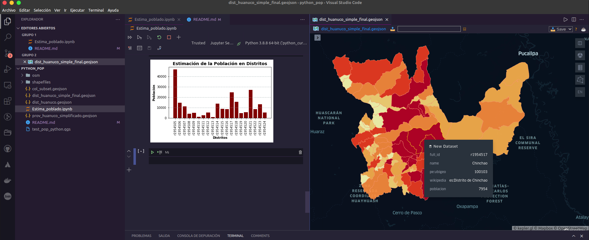

# Datos de Población con Python

Se presenta la estimación de datos de población apoyados con Python, se comparte un Notebook de Jupyter y también archivos considerados para el uso del código de Python.
